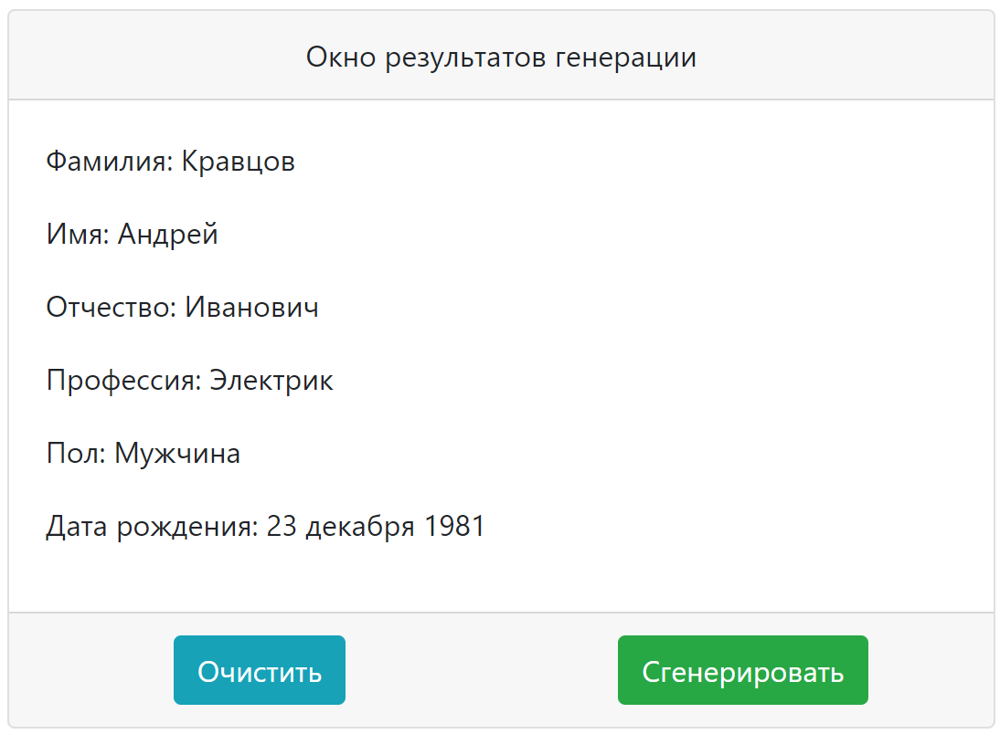

# Практическая работа модуль 9

Практическое задания в рамках курса Fullstack веб-разработчик на JavaScript и PHP:

## Задание 9.11.1 (HW-03) — Создание генератора случайных пользовательских данных

---

## Интерфейс

### Интерактивные элементы

- Кнопка "Очистить";
- Кнопка "Сгенерировать".

## Используемые технологии

- HTML

- CSS в том числе Bootstrap

- JS

## Как открыть/запустить

Зайти в папку сайта в файловом менеджере, кликнуть 2 раза по файлу index.html или по [cсылке](index.html).
